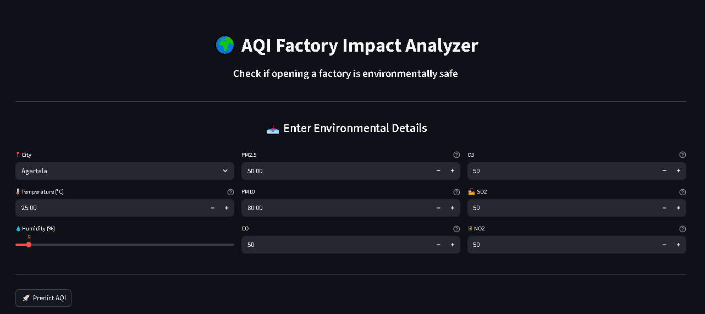
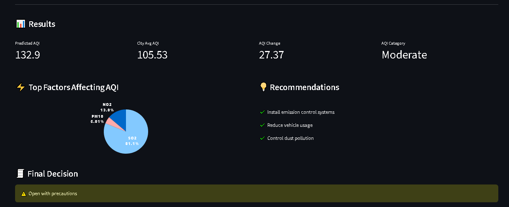

🌍 AQI Prediction & Factory Impact Analyzer

📌 Project Overview

This project predicts the Air Quality Index (AQI) using machine learning and analyzes whether opening a factory in a specific city is environmentally safe.

It also provides data-driven recommendations based on pollution factors.

---

🎯 Objectives

- Predict AQI using ML models
- Compare multiple regression algorithms
- Identify key factors affecting AQI
- Provide smart recommendations
- Assist in decision-making for factory setup

---

🧠 Models Used

- Linear Regression
- Ridge Regression
- Decision Tree
- K-Nearest Neighbors (KNN)
- Support Vector Regression (SVR)
- Random Forest (Final Model ⭐)

---

📊 Model Performance

Model| R² Score| MAE
Random Forest| 0.78| 13.95
KNN| 0.75| 14.55
Ridge| 0.71| ~19
Linear Regression| 0.71| ~19
Decision Tree| 0.58| 19.57
SVR| 0.45| 15.34

👉 Random Forest was selected as the final model due to highest accuracy.

---

⚙️ Features Used

- 🌡️ Temperature
- 💧 Humidity
- 🌫️ PM2.5
- 🌁 PM10
- 🧪 CO
- ☀️ O₃
- 🏭 SO2
- 🚗 NO2

---

🚀 Streamlit App Features

✔ AQI Prediction
✔ AQI Category Display
✔ Comparison with City Average AQI
✔ Top 3 Factors Affecting AQI
✔ Environmental Recommendations
✔ Final Decision (Factory Feasibility)

---

🧪 Model Optimization

- Sampling used for large dataset
- Hyperparameter tuning (RandomizedSearchCV)
- Model comparison using R² and MAE

---

📂 Dataset

Due to large file size, the dataset is not included in this repository.

🔗 Dataset Link:
https://share.google/xPioaLeZKrtYkR2I9

---

⚠️ Important Note

The ".pkl" model file required to run the Streamlit app is generated in:

📄 AQI_Prediction.ipynb

👉 Please run the notebook to generate the model file before running the app.

---

🛠️ Technologies Used

- Python
- Pandas
- NumPy
- Scikit-learn
- Streamlit
- Joblib
- Seaborn
- Matplotlib

---

💡 Key Insights

- AQI depends on complex non-linear relationships
- Random Forest performs best for this dataset
- Default model sometimes outperforms tuned model
- Efficient model size is important for deployment

---

▶️ How to Run

1. Clone the repository
2. Run "AQI_Prediction.ipynb" to generate ".pkl" file
3. Run the Streamlit app "code.py"

streamlit run code.py

---

## 📸 Application Preview

---

👨‍💻 Author

Malbari Iqra

--- 
